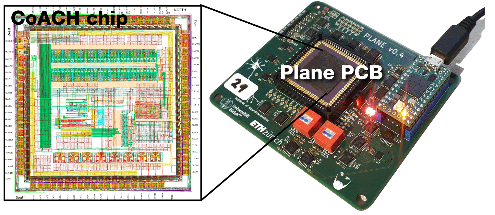
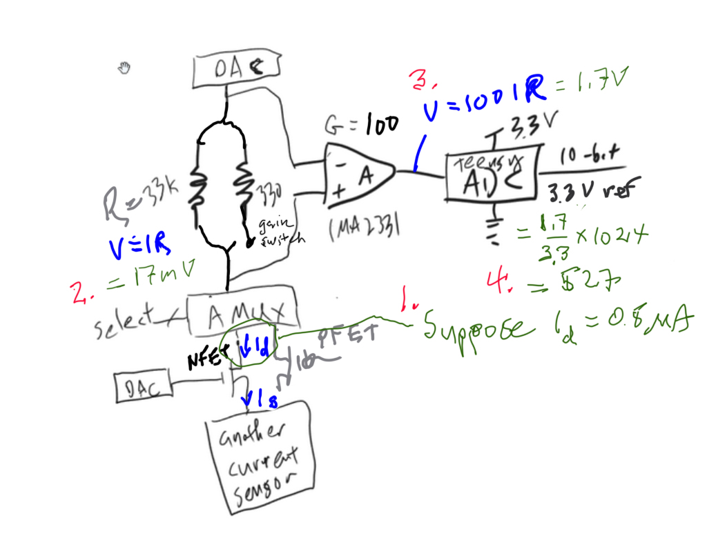
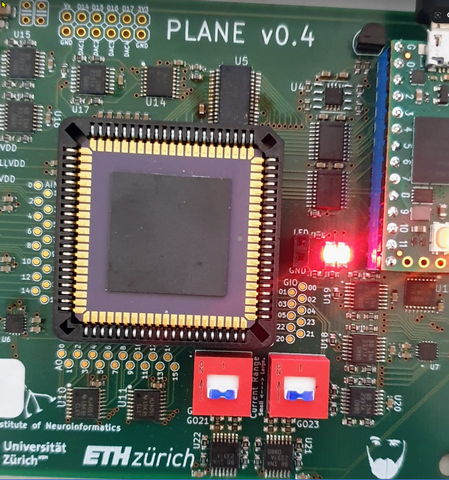
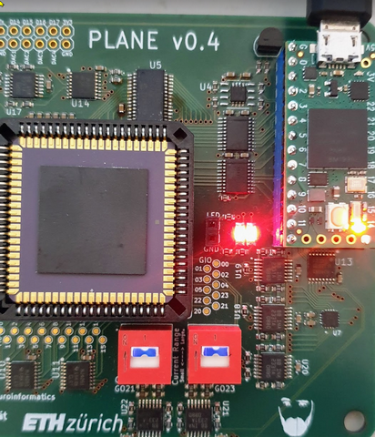
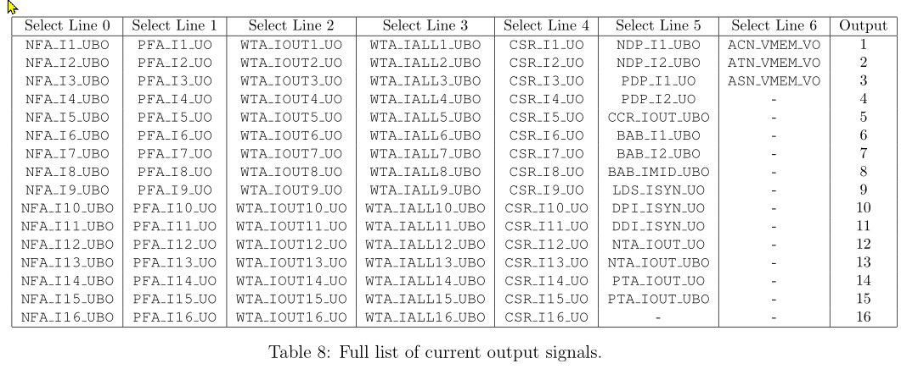
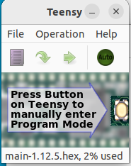

# Overview
- [Overview](#overview)
- [Using git to pull the latest updated exercises](#using-git-to-pull-the-latest-updated-exercises)
- [Starting notebook](#starting-notebook)
  - [Using vscode (Visual Studio Code)](#using-vscode-visual-studio-code)
    - [vscode tips](#vscode-tips)
  - [Using jupyter note from web browser](#using-jupyter-note-from-web-browser)
- [Exercises Software setup](#exercises-software-setup)
  - [Clone the exercises](#clone-the-exercises)
  - [Making a Python Conda environment](#making-a-python-conda-environment)
    - [Not using vscode](#not-using-vscode)
    - [Using vscode](#using-vscode)
  - [Installing necessay packages from requirements.txt](#installing-necessay-packages-from-requirementstxt)
  - [Installing or building the pyplane library](#installing-or-building-the-pyplane-library)
      - [Example of `pip install pyplane`](#example-of-pip-install-pyplane)
    - [Building pyplane or using a virtual machine](#building-pyplane-or-using-a-virtual-machine)
      - [Steps to build pyplane](#steps-to-build-pyplane)
      - [Troubleshooting](#troubleshooting)
  - [Virtual machines for people who do not running a native Ubuntu OS](#virtual-machines-for-people-who-do-not-running-a-native-ubuntu-os)
    - [Windows 11 (and maybe 10) users who want to use WSL2 to run an Ubuntu VM from Windows](#windows-11-and-maybe-10-users-who-want-to-use-wsl2-to-run-an-ubuntu-vm-from-windows)
      - [USB on WSL2](#usb-on-wsl2)
    - [Apple Mac users (either Intel (x86) or Apple (M1 ARM) silicon)](#apple-mac-users-either-intel-x86-or-apple-m1-arm-silicon)
    - [Windows users or any other x86 users (not apple silicon M1 ARM): Making a virtual machine for exercises](#windows-users-or-any-other-x86-users-not-apple-silicon-m1-arm-making-a-virtual-machine-for-exercises)
      - [Step 1. Download VirtualBox](#step-1-download-virtualbox)
      - [Step 2. Download the NE1 virtual machine](#step-2-download-the-ne1-virtual-machine)
      - [Step 3. Import the NE1 virtual machine in VirtualBox](#step-3-import-the-ne1-virtual-machine-in-virtualbox)
      - [VM notes](#vm-notes)
- [CoACH chip](#coach-chip)
  - [Troubleshooting your CoACH chip setup](#troubleshooting-your-coach-chip-setup)
    - [WSL2 USB troubleshooting](#wsl2-usb-troubleshooting)
- [The _ne1_ Python library and the _CoACH_ Python class](#the-ne1-python-library-and-the-coach-python-class)
    - [Coach code example](#coach-code-example)
    - [Coach code output](#coach-code-output)
    - [ne1 and Coach() doc API](#ne1-and-coach-doc-api)
  - [How FET currents are measured](#how-fet-currents-are-measured)
    - [Current measurement range/gain setting](#current-measurement-rangegain-setting)
      - [High gain, small current measurements](#high-gain-small-current-measurements)
      - [Low gain, high current measurements](#low-gain-high-current-measurements)
  - [How other currents are measured using C2F circuits](#how-other-currents-are-measured-using-c2f-circuits)
  - [How voltages are supplied to CoACH by the DACs](#how-voltages-are-supplied-to-coach-by-the-dacs)
  - [Getting a firmware out of date error? (Updating firmware using Teensy loader GUI)](#getting-a-firmware-out-of-date-error-updating-firmware-using-teensy-loader-gui)




The laboratory exercises for the course [Neuromorphic Engineering I](https://avlsi.ini.uzh.ch) (*NE1*) use the CoACH chip on its _Plane_ PCB.

A Python-based interface called [pyplane](https://code.ini.uzh.ch/CoACH/CoACH_Teensy_interface) allows low level communication with the CoACH chip through Python. The _Coach()_ class in [ne1.py](ne1.py) wraps pyplane to make the experiments simpler for you.  See [The _ne1_ Python library and the _CoACH_ Python class](#the-ne1-python-library-and-the-coach-python-class) and the [Coach chip documentation](https://drive.google.com/drive/u/0/folders/1VBPKVfS9zwu_I2ExR1D0jU2eCSgleoQG).

Each week you will have to complete the pre-lab, lab, and post-lab contained in a single notebook. **Note that you must complete the pre-lab before you come to the exercise.**

In the notebook you will have to include both your answers to the theoretical questions (in Markdown cells) 
and the solutions (code, plots, analysis,...) to the exercises that require working with the chip.

After you complete the lab, each student should upload an **individual** copy of the notebook named with the students name (e.g. Lab1_Setup_GroupXX_Marilyn_Monroe.html) to the course dropbox for the week's exercise as either HTML of PDF (**please do not upload the .ipynb notebooks**).
If your TA has given you a group number then use it for the XX.

---

# Using git to pull the latest updated exercises
Each week, before starting the exercise, update your local clone with latest updated version of the exercise.

**Pull changes from CoACH-labs to your working copy.** From a terminal, assuming you have git installed
```
cd CoACH-labs
git pull
```

**Before you start the exercise, make a copy of the .ipynb notebook and work on that copy.**

# Starting notebook
## Using vscode (Visual Studio Code)
(**Recommended, gives much better coding support than using web notebook**).

_vscode_ users (https://code.visualstudio.com/download) can nicely run the Python notebooks from within vscode.
### vscode tips
1. For working in the exercises, it is handy to install a keyboard shortcut to wrap any variable in the f-string to format the number in engineering notation. Each exercise has the import `from engineering_notation import EngNumber as ef`. Then the string can be formatted as in this f-string `f'Ids={ef(ids)}A'`. Put this snippet in your vscode keybindings.json, then the keyboard shortcut `alt+shift+e` will wrap the selected text in the formatter:
```
// Place your key bindings in this file to override the defaults
[
    {
        "key": "alt+shift+e",
        "command": "editor.action.insertSnippet",
        "when": "editorTextFocus",
        "args": {
            "snippet": "{ef(${TM_SELECTED_TEXT})}"
        }
    }
]
```

## Using jupyter note from web browser
From a terminal after you cd to the CoACH-labs directory, you should be able to start an exercise notebook with

```bash
jupyter <notebook_name>.ipynb
```

A web interface should open to the jupyter kernel so you can run the exercise.


# Exercises Software setup

The CoACH interface requires Ubuntu 18.04 or later, or some other Linux where the Python extension module, pyplane <https://code.ini.uzh.ch/CoACH/CoACH_Teensy_interface>, can be built.

Windows 11 users can use WSL2 Ubuntu 20 virtual machine (VM) and map the USB device through to this VM.

## Clone the exercises
You can download individual exercises, but its probably best to just clone the entire CoACH-labs repo:
````bash
sudo apt install git # if you don't have git already
git clone https://code.ini.uzh.ch/CoACH/CoACH-labs
cd CoACH-labs

````
Do this will also give you a local copy of readme and the _requirements.txt_ file that has necessary libraries for all exercises
## Making a Python Conda environment

If you are not using the NE1 virtual machine, then we **highly recommend** that you use _miniconda_ to install a specific version of Python in its own protected environment. You do not want to pollute your system Python with particular libraries.  Conda is your friend here.

### Not using vscode
Go to <https://docs.conda.io/projects/miniconda/en/latest/index.html> to get it. The follow these steps to make a conda environment (env) for NE1
and to install all the Python libraries (in requirements.txt) to this env:

```bash
conda create -n 'ne1' python=3.9 --yes # make the env with this specific Python version installed to it, along with pip etc
conda activate ne1 # activate it; now everything points to this Python and its own library path
```

### Using vscode
_vscode_ provides built-in (or via extensions) conda support. Users typically will make an environment right in their project folder in a _.conda_ folder. This env is automagically activated in the vscode project when opening a terminal from vscode. (If not, it can be activated with `conda activate .conda`). 
It is still necessary to run `pip install -r requirements.txt` from this terminal.

## Installing necessay packages from requirements.txt
Now install all the necessary Python packages to your Python Conda enviroment:
```
cd CoACH-labs # cd to where you cloned CoACH-labs
pip install -r requirements.txt # install all the libs you need for exercises
 ```
 


## Installing or building the pyplane library

If you have Ubuntu 18.04 or later and Python 3.6, 3.7, 3.8 or 3.9 on your laptop, you can install the pyplane interface package using pip install:

`pip install pyplane`


#### Example of `pip install pyplane`
```bash
(base) root@tobi-joule-amd:~/GitLab/CoACH-labs# conda activate /root/GitLab/CoACH-labs/.conda
(/root/GitLab/CoACH-labs/.conda) root@tobi-joule-amd:~/GitLab/CoACH-labs# # pip install pyplane
Collecting pyplane
  Using cached pyplane-1.12.4-cp39-cp39-manylinux2014_x86_64.whl.metadata (312 bytes)
Using cached pyplane-1.12.4-cp39-cp39-manylinux2014_x86_64.whl (683 kB)
Installing collected packages: pyplane
Successfully installed pyplane-1.12.4
```

If you get the error that there is no supported version, then it is likely you are not using one of the versions of Python listed above or you are running on a platform that is not supported in the pypi distribution.
Check your Python version with `python --version`.

Users with Python 3.10 or later can either install and use an earlier version of Python,
or take the same approach as Mac users with ARM processors as described below under
[Apple Mac users (either Intel (x86) or Apple (M1 ARM) silicon)](#apple-mac-users-either-intel-x86-or-apple-m1-arm-silicon).

### Building pyplane or using a virtual machine

If pyplane install failed, read this section. Otherwise you can skip this section.

You can build the pyplane extension yourself without too much trouble.
See [pyplane issue 134](https://code.ini.uzh.ch/CoACH/CoACH_Teensy_interface/-/issues/134) for possible updates to this necessity.

#### Steps to build pyplane

Here are the steps to build pyplane yourself:
1. Clone the CoACH interface project to a local folder
```bash
git clone https://code.ini.uzh.ch/CoACH/CoACH_Teensy_interface
conda activate ne1 # if you have already made a conda env
pip install pybind11[global] # you need this to build the bindings from Python to native code, not that [global] option is essential here
brew install cmake # install cmake for building the Makefile(s) - you should not need to be root
```
2. Next, follow the [command line build](https://code.ini.uzh.ch/CoACH/CoACH_Teensy_interface#command-line-build):
```bash
cd CoACH_Teensy_interface # change to where you cloned 
mkdir build && cd build
cmake ../src
make -j # runs make, -j specifies parallel build
```
Now locate the pyplane _.so_ file in the folder _build/pc/pyplane/_ and copy it to your _CoACH-labs_ folder; it will be found if it is on the Python path. You can check your path like this: 

From a Python session:
```
>>> import sys
>>> sys.path
['', '/root/miniconda3/envs/ne1/lib/python38.zip', '/root/miniconda3/envs/ne1/lib/python3.8', '/root/miniconda3/envs/ne1/lib/python3.8/lib-dynload', '/root/miniconda3/envs/ne1/lib/python3.8/site-packages']
>>> 
```
Since the current folder `` is on  the path you should be able to import pyplane.

If you are debugging pyplane, you can use a call like this to put the build directory on your path:
```python
import sys
sys.path.append('/home/tobi/GitLab/CoACH_Teensy_interface/build/pc/pyplane')
import pyplane # suceeeds if the .so is on that build folder
```
1. You should be able to build pyplane for any version of Python 3. The earliest that has been tested is 3.5; the latest 3.9, but you don't have to use a version of Python in this range. There is no reason to believe that pyplane won't be just fine with the newest Python (3.12 at the time of writing).
2. Be sure that the _.so_ shared library is the correct one for your Python, e.g. don't try to use a Python 3.8 _.so_ for a Python 3.9 environment; it will not load.

#### Troubleshooting
1. If you cannot `brew install cmake`, then see https://stackoverflow.com/questions/19039404/error-cowardly-refusing-to-sudo-brew-install-for-installing-glue-0-3-for-mac. Specifically, the simplest solution is probably `sudo chown root /usr/local/bin/brew`. 
2. If you run into a compile error about the function `fsyncdata` in one of the .cpp files, then edit that file and replace `fsyncdata` with `fsync`


---

## Virtual machines for people who do not running a native Ubuntu OS

For students that have Windows on their laptop, we have set-up an Ubuntu-based virtual machine with the necessary libraries to communicate with the board. This VM includes a pre-installed [vscode](https://code.visualstudio.com/) that is great for working with Python jupyter notebooks.


### Windows 11 (and maybe 10) users who want to use WSL2 to run an Ubuntu VM from Windows

It is possible to make an Ubuntu VM using [WSL2](https://learn.microsoft.com/en-us/windows/wsl/) (Windows Subsystem for Linux, version 2) and access the CoACH chip from it. Here are some tips:
1. **WSL2:** Update windows and install Windows Subsystem for Linux: https://learn.microsoft.com/en-us/windows/wsl/install
2. **Ubuntu:** Install an Ubuntu VM, we recommend Ubuntu 20.04 for NE1 exercises. **We recommend that you do not make a user, just run as root user.** That will save a lot of hassle with USB permissions.
3. **vscode:** Windows users who want to can use vscode to access the notebooks "remotely" running inside WSL2. See https://learn.microsoft.com/en-us/windows/wsl/tutorials/wsl-vscode

#### USB on WSL2

 4. **USB:** Map the CoACH board USB interface to the Teensy microcontroller with _usbipd-win_ : https://learn.microsoft.com/en-us/windows/wsl/connect-usb. 
    - A restart will be required after installing to usbipd-win to windows and then follow the rest of the steps for installing the required packages inside your WSL2 Ubuntu VM.
    - you might need to `sudo apt update` in WSL2 before installing the packages.
    - From a windows PowerShell (not inside the Ubuntu VM), run `usbipd wsl list` and look for the CoACH board; it has VID:PID _0403:6014_ and is listed as _USB Serial Converter_.
    - A (sometimes) useful GUI wrapper is https://gitlab.com/alelec/wsl-usb-gui; it gives you a GUI view of attached USB devices and allows you to permanently map them to WSL2, but it has problems with multiple WSL2 distributions installed at the same time.
    - For vscode users, there is a very handy extension [USBIP Connect](https://marketplace.visualstudio.com/items?itemName=thecreativedodo.usbip-connect) that gives you *Attach* and *Detach* buttons at the bottom of your vscode window.

You can attach the device to your WSL2 Ubuntu VM from a PowerShell command line, e.g. like this:
```powershell
> usbipd wsl list
BUSID  VID:PID    DEVICE    STATE
13-1   16c0:0483  USB Serial Device (COM7)   Not attached
```
Note the BUSID (here _13-1_), it is used to attach your device:
```powershell
> usbipd wsl attach --busid 13-1
> # you might need to first force the binding if there is error:
> # usbipd bind --force --busid 13-1
```
(You only need the `--distribution <distro>` switch if you have mulitple distros installed.)

If you are running `dmesg -w` in your Ubuntu terminal when you do the `usbipd attach` command, you will see something like this that shows the CoACH board mapped through to **/dev/ttyACM0**:
```
[   41.787769] usb 1-1: new high-speed USB device number 2 using vhci_hcd
[   41.947787] usb 1-1: SetAddress Request (2) to port 0
[   41.984561] usb 1-1: New USB device found, idVendor=16c0, idProduct=0483, bcdDevice= 2.79
[   41.985205] usb 1-1: New USB device strings: Mfr=1, Product=2, SerialNumber=3
[   41.985725] usb 1-1: Product: USB Serial
[   41.985946] usb 1-1: Manufacturer: Teensyduino
[   41.986322] usb 1-1: SerialNumber: 10129780
```
**Note: the device will show up as Teensyduino, not FTDI. The FTDI device is for programming the board.**

You can use this command in your terminal to filter the dmesg output to just show the port
```bash
echo -n "/dev/"; dmesg | grep tty|grep USB|rev|awk '{print $1}'|rev
/dev/ttyACM0
```
Note that the device appears as _**/dev/ttyACM0**_ here. If you have incorrectly mapped through the FTDI interface, you will get _/dev/ttyUSB0_. Do not use this one!

If everything is setup, then running `lsusb` in your Ubuntu terminal should show you the CoACH board (ID 16c0:0483) attached:
```bash
(base) root@tobi-joule-amd:/mnt/f/tobi/Dropbox (Personal)/GitLab/CoACH-labs# lsusb
...
Bus 001 Device 002: ID 16c0:0483 Van Ooijen Technische Informatica Teensyduino Serial
```

**This whole process is rather touchy and tedious but once you get it set up it should work robustly.**

### Apple Mac users (either Intel (x86) or Apple (M1 ARM) silicon)

Mac users with ARM processor (M1) must compile pyplane by cloning from https://code.ini.uzh.ch/CoACH/CoACH_Teensy_interface and building locally.
Refer to its [readme](https://code.ini.uzh.ch/CoACH/CoACH_Teensy_interface/-/blob/master/readme.md) or see [the steps for building pyplane](#steps-to-build-pyplane) above.


### Windows users or any other x86 users (not apple silicon M1 ARM): Making a virtual machine for exercises
Import the virtual machine on VirtualBox (for Windows and Mac users)

Note this is not recommended for Apple Silicon Macs (ARM M1 processors), because the x86 virtual machine will need to be emulated and will run very slowly.

#### Step 1. Download VirtualBox

You can download VirtualBox from the link: `https://www.virtualbox.org/wiki/Downloads`

Execute the .exe file and follow the steps. In the window "Would you like to install this device software" select Install.

Once the installation is complete, press Finish and launch the VirtualBox.


#### Step 2. Download the NE1 virtual machine

You can download the necessary files for the NE-I virtual machine from the link: https://drive.google.com/drive/folders/1EkAQKl0EJHRgRVkyJFT04wVFNGLAdWZY?usp=sharing

Save the .ova somewhere. It is a big file >7GB. 


#### Step 3. Import the NE1 virtual machine in VirtualBox

1. Once you launch VirtualBox, the window Oracle VM VirtualBox Manager should appear on your screen. 
2. In the menu at the top select File > Import Appliance 
3. On the Import Virtual Appliance wizard, click the browse icon button to choose the VM file you have downloaded in Step 2.
4. Then choose the hard disk location where you want the Virtual Machine to be saved and run, and then select Import.
5. Once the import is complete, you should see a new Virtual Machine named "Ubuntu 20 NE1 coach chip labs" in the VirtualBox Manager window.
6. Select the NE1 machine and press Start. 
7. Once the virtual machine is running, you can log in with the following Username and Password.

`Username: ne1`

`Password: ne1`

This Ubuntu 20 machine has Python 3.8 with all the necessary libraries, code (vscode, for people who prefer to work with notebooks this way) and various other useful utilities.

#### VM notes
1. The CoACH board only works with USB 1.1 selected for the USB settings. You can only change this if the machine is not running.


# CoACH chip
  * [CoACH chip documentation on google drive](https://drive.google.com/drive/u/0/folders/1VBPKVfS9zwu_I2ExR1D0jU2eCSgleoQG)
    * [Individual schematics](https://drive.google.com/drive/u/0/folders/1DV9KEKPOgDyWiPYjSmDNAz_ivrd46Jhy)
    * [Cadence CoACH chip schematics](https://drive.google.com/file/d/1aKyk_WNLByL-TeaC5pwbsASZ-xe-0xt-/view?usp=drive_link)
    * [CoACH Chip architecture report](https://drive.google.com/file/d/1ljX2ACBuOxAENr4ZQkguyslIfM6LT5ks/view?usp=drive_link)
    * [CoACH Chip layout](https://drive.google.com/file/d/1N5wpaFbK8ohhjAkkk18IT0ur1Hi_r7I-/view?usp=drive_link)
    * [Plane v0.4 PCB schematic](https://drive.google.com/file/d/1CjJU0dFmwSffJ9RzTGwdElKgMWlnypq3/view?usp=drive_link)
  * [CoACH docs gitlab repo](https://code.ini.uzh.ch/CoACH/CoACH-docs)
    * [Individual Cell layouts](https://code.ini.uzh.ch/CoACH/CoACH-docs/-/tree/master/layouts)

## Troubleshooting your CoACH chip setup
* **If you cannot open the CoACH board**
  * Does the board appear when you plug it in? Use `lsusb` to check:
     ```bash
     ne1@ne1-VirtualBox:~/CoACH-labs$ lsusb
      Bus 001 Device 009: ID 16c0:0483 Van Ooijen Technische Informatica *Teensyduino* Serial
      Bus 001 Device 002: ID 80ee:0021 VirtualBox USB Tablet
      Bus 001 Device 001: ID 1d6b:0001 Linux Foundation 1.1 root hub
      ne1@ne1-VirtualBox:~/CoACH-labs$ 
     ```
  * You can also use `dmesg` to see the system hardware log (use `dmesg -w` to keep it running):
  ```bash
      dmesg
      [59719.912486] usb 1-2: New USB device found, idVendor=16c0, idProduct=0483, bcdDevice= 2.79
      [59719.912489] usb 1-2: New USB device strings: Mfr=1, Product=2, SerialNumber=3
      [59719.912491] usb 1-2: Product: USB Serial
      [59719.912492] usb 1-2: Manufacturer: Teensyduino
      [59719.912493] usb 1-2: SerialNumber: 10131950
      [59719.920028] cdc_acm 1-2:1.0: ttyACM1: USB ACM device
  ```
* **Are you getting `RuntimeError: write: Bad file descriptor`?**  If so, maybe you need to reboot your VM because the system seems to get confused when it assigns a new device descriptor, e.g. _/dev/ttyACM1_ after you replug the board too fast.
* **Is the USB cable bad?** Try another cable.
* **Is the USB cable plugged in correctly?** If not,the board LEDs will not light up. The USB socket is quite tight on the Teensy boards.
* Did you try a different CoACH board?
* You might need to reboot your virtual machine.
* **Is your Ubuntu 20 VirtualBox VM setup to use USB 1.1?** It only works in this mode.
* It's possible that replugging the board will give you a new USB descriptor, e.g. */dev/ttyACM1* (instead of 0)
* **Did you push the Teensy board reset button?**  This puts the board into firmware download mode; it does not reset it. Replug the board.
* **Are you running the labs directly from the CoACH-labs folder?**  You need to do this so `from ne1 import Coach` can find the _Coach_ class.
* **Getting a firmware out of date error?**  See [updating firmware](#getting-a-firmware-out-of-date-error-updating-firmware-using-teensy-loader-gui).

### WSL2 USB troubleshooting
If you get the error that your Teensy device is in _error state_, then you can try to force the binding again and then again attach.

NOTE that the first device (10-2) is the the Teensy debugging endpoint. Use the one that appears as a COM port (here COM8).

This is a powershell session output:
```powershell
Microsoft Windows [Version 10.0.19045.3570]
(c) Microsoft Corporation. All rights reserved.

>usbipd wsl list
BUSID  VID:PID    DEVICE                                                        STATE
10-2   0403:6014  USB Serial Converter                                          Not attached
13-1   16c0:0483  USB Serial Device (COM8)                                      Not attached

usbipd: warning: Unknown USB filter 'nxusbf' may be incompatible with this software; 'bind --force' may be required.

>usbipd wsl attach --busid 13-1 # attach results in error state
usbip: error: Attach Request for 13-1 failed - Device in error state

usbipd: error: Failed to attach device with busid '13-1'.

>usbipd bind --force --busid 13-1 # force the binding
usbipd: info: Device with busid '13-1' was already shared.

>usbipd wsl attach --busid 13-1 # suceeded here
```
# The _ne1_ Python library and the _CoACH_ Python class

The [_ne1_ library](ne1.py) (see [ne1 API doc](./ne1.md)) mainly defines a class called _Coach_ to make it easier to work with the CoACH chip on its Plane PCB

_Coach()_ lets you easily open/close the PCB and set up the lab exercise experiments. See the Labs for examples of its use. Here is a simple example:

### Coach code example
```python       
from ne1 import * # import the library
c=Coach()         # make an instance (it is a singleton class so even if you make another it will be the same one)
c.open()          # open the board (actually not needed, since all call check already)
c.setup_nfet()    # set up the NFET for measurement
c.set_nfet_vs(0)  # set the source voltage
c.set_nfet_vd(1)  #   drain voltage
import numpy as np
from engineering_notation import EngNumber as ef # format numbers in engineering format quickly, e.g. ef(2e-9)='2n'
for vgn in np.linspace(.4,.6,10):   # sweep the gate voltage
    c.set_nfet_vg(vgn)  # set gate voltage
    idn=c.measure_nfet_id() # measure drain current
    print(f'vgn={ef(vgn)}V: idn={ef(idn)}A')
p.close()        # close the board if you think you might access it from elsewhere
``` 
### Coach code output

    vgn=422.22mV: idn=41.26nA
    vgn=444.44mV: idn=44.43nA
    ...
    vgn=600mV: idn=680.42nA

### ne1 and Coach() doc API
The [ne1 API doc](./ne1.md) shows the _ Coach()_ class methods and other useful methods available in [ne1.py](./ne1.py). 

(This file is automatically generated by installing [pydoc-markdown](https://niklasrosenstein.github.io/pydoc-markdown/usage/cli-and-api/) and running the command)
```bash
pip install pydoc-markdown
cd CoACH-labs
pydoc-markdown -p ne1 --render-toc >ne1.md
```
    
## How FET currents are measured
Below taken from [Alex Schwalb's master's thesis report on the CoACH chip PCB](https://drive.google.com/drive/folders/1VBPKVfS9zwu_I2ExR1D0jU2eCSgleoQG)

The FET source and drain currents must be measured using an off-chip current sensing chip, because
in addition to measuring the current at those nodes, the voltage has to be set. These nodes are connected
to pins GO0 to GO5 and GO20 to GO23 as seen in Appendix 1.

On the PCB, to get the current, we measure
the voltage drop across a series resistor with an [INA2331 instrumentation amplifier](https://www.ti.com/lit/ds/symlink/ina331.pdf?ts=1696597779043&ref_url=https%253A%252F%252Fwww.google.com%252F) whose output is converted to digital with the Teeeny 10-bit ADC.

(Previous boards used a [INA219 current monitor chip](https://www.ti.com/lit/ds/symlink/ina219.pdf). The INA219 converts this measured voltage to a
twelve bit digital value and sends it to the Teensy using I2C. The INA219 is bidirectional, so it can measure
currents that are sunk or sourced to the CoACH chip.)

The shunt resistor for the current measurement is set by the red switches on the PCB. The large resistor has R=33kΩ and the small value is R=330Ω.

The INA2331 voltage gain is _G = 5 + (5R2/R1)_ where _R2_=190kΩ and _R1_=10kΩ. Therefore its gain is _G=5+5*(19)=100_ V/V. That way, a 1μA current across the 33kΩ resistor multiplies the 33mV voltage to 33mV*100=3.3V, which is the power supply of the INA2331. That is why the limit of current in high gain configuration is 1μA.

The current ADC resolution (LSB) is (in principle) documented in [usb_packet.h](https://code.ini.uzh.ch/CoACH/CoACH_Teensy_interface/-/blob/master/src/usb_packets.h).
* For the NFET/PFET ADC, 
  * **Low gain, high range:**: (Switch is toward Teensy.) The resolution is 2.44nA. The maximum current is 100μA.
  * **High gain, low range:**: (Switch is away from Teensy.) The resolution is 0.244nA in The maximum current is 1μA.

**In practice the smallest currents we have been able to measure from the FETs is about 10nA, which is about 50 times the expected resolution. There is a leakage path that is not yet understood.**

A sketch shows an outline of how it works, in the case of measuring the NFET drain current Id, which is here 0.5uA. The end result is that that the converted value is 527, which is returned by `coach.measure_nfet_id()` as 0.5uA:



### Current measurement range/gain setting
The switch settings are easy to remember. Holding the board upright, 
 * Putting the switches UP sets up the board for HIGH current measurements. 
 * Putting them DOWN sets up for LOW current measurements.

#### High gain, small current measurements
To set the current ADCs to high gain (e.g. for subthreshold measurements), use this switch setting. **In this configuration the measurements saturate at 1μA.**



#### Low gain, high current measurements
To set the current ADCs to lower gain (e.g. for superthreshold measurements), use this switch setting. The measurement saturates at 100μA:



## How other currents are measured using C2F circuits

To measure very small current (in our case from 1 pA to 10 nA), a very widely used method is called current-to-frequency conversion. The output frequency *f* can be expressed as a function of input current *I*:
```math
f = \frac{I}{C \Delta U}
```
where *C* is a capacitance that is charged by the input current, and *ΔU* is the difference of the reference voltages where the circuit resets. For more details please the C2F paper linked above.

The C2F circuit is unidirectional for input current and expects a n-type current sink at its input. 

To measure both signs (e.g. in the case of the transconductance amplifiers) we use two copies of the same circuit, one of them mirrored into the C2F.
The current outputs are read out using C2F circuits that are arranged in a large bank of C2F circuits.
The monitors are essentially neurons, and spike at a frequency that correlates with the input current. 

The current-monitor bank comprises 16 cells, with a 7-way select current-multiplexer
to output the 98 current output signals (the bulk of current outputs come from the array
circuits). The full mapping of output current signals is shown in Table 8 of the [Chip design report](https://drive.google.com/file/d/1ljX2ACBuOxAENr4ZQkguyslIfM6LT5ks/view?usp=sharing), and is copied below for reference:



For more details, see [Lab4](Lab4_Static_GroupNumber_FirstName_LastName.ipynb) and the [Chip design report](https://drive.google.com/file/d/1ljX2ACBuOxAENr4ZQkguyslIfM6LT5ks/view?usp=sharing).

## How voltages are supplied to CoACH by the DACs

Voltages drive the CoACH circuits from four [10-bit DAC53608](https://drive.google.com/file/d/16buxA_tguNB_oKbK_hF1rC479WKIDtUs/view?usp=sharing) Digital to Analog Converters. This 10-bit converter has reference voltage of 1.8V coming from the PCSI variant of the [TPS770](https://drive.google.com/file/d/1WS8372R_JP9R8kzcLx_q4lKx_MjaAlYX/view?usp=drive_link) linear regulator. Therefore, the smallest output voltage step is 1800/1024=1.76mV.

## Getting a firmware out of date error? (Updating firmware using Teensy loader GUI)

Getting a error from [Coach()](#the-ne1-python-library-and-the-coach-python-class) that the firmware is out of date?

1. Download [teensy loader](https://www.pjrc.com/teensy/loader.html), and then (on linux) untar _teensy_linux64.tar.gz_ with `tar xzf _teensy_linux64.tar.gz`. It will untar to a single executable, e.g. _teensy_ on linux.
2. Run `teensy`. If you are on linux you must be root, so `sudo ./teensy`.
3. That will pop up the loader 



1. Use the menu File/Open HEX File to load the teensy firmware .hex file. As of 2023, the latest version is [main-1.12.5.hex](https://drive.google.com/file/d/1z-leSQmILYjHY7ZDP-p6TaGMWlrGOcpy/view?usp=sharing). Download it to a local folder.
2. Hit the Teensy reset button next to the orange LED. (It actually puts the board in firmware download mode.) The small red LED next to the USB cable should light up, and the orange one should turn off. The teensy GUI application will also ungrey the _Program_ button.
3. Hit the green right/down **Program** arrow. It should download the firmware to the board. When it is done, the LEDs will stop blinking. 
4. To be certain the board is running and not left in firmware upload state, unplug the USB and plug it in again. Your board should now be updated. You can check it with the following lines of code using the [Coach()](https://code.ini.uzh.ch/CoACH/CoACH-labs#the-ne1-python-library-and-the-coach-python-class)  class.
  
```python
from ne1 import Coach # import Coach() class
import logging
p=Coach()
p.open()
p.close()
```
You should see something like this:
```
[INFO]: 2023-10-19 14:46:01,755 - NE1 - Opened CoACH at /dev/ttyACM0 with firmware version (1, 12, 5) (File "/home/tobi/Dropbox/GitLab/CoACH-labs/ne1.py", line 145, in open)
[INFO]: 2023-10-19 14:46:01,757 - NE1 - closing device (deleting pyplane.Plane() object (File "/home/tobi/Dropbox/GitLab/CoACH-labs/ne1.py", line 208, in close)
```


